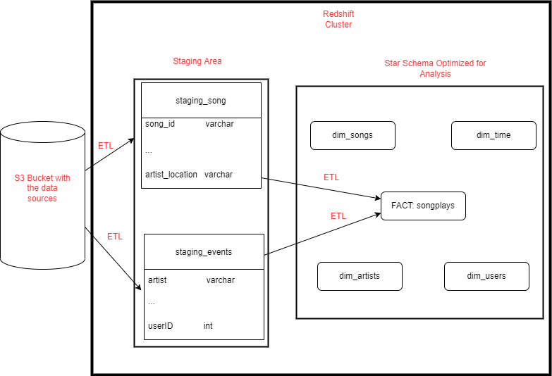

## Project Description
A music streaming startup, Sparkify, has grown their user base and song database and want to move their processes and data onto the cloud. 
Their data resides in an S3 bucket, in a directory of JSON logs on user activity on the app, as well as a directory with JSON metadata on the songs in their app.

Sparkify needs a data engineer to create an ETL pipeline that extracts the data from S3, stages them in Redshift, and transforms the data into a set of dimensional tables. This will enable Sparkify's data analysists to derive insights about the listening behaviour of their users.

As the data engineer, it is my job to create the ETL pipeline and the DWH to support the business analysists.

## Data Modell for Song Play Analysis
Using the song and event datasets, a **star schema** will be created which is optimized for queries on song play analysis. This includes the following tables:

### Fact Table
songplays - records in event data associated with song plays i.e. records with page NextSong
	songplay_id, start_time, user_id, level, song_id, artist_id, session_id, location, user_agent

### Dimension Tables

users - users in the app
	user_id, first_name, last_name, gender, level

songs - songs in music database
	song_id, title, artist_id, year, duration

artists - artists in music database
	artist_id, name, location, lattitude, longitude

time - timestamps of records in songplays broken down into specific units
	start_time, hour, day, week, month, year, weekday

### How to run
1) Paste your AWS credentials into config_cluster.cfg
2) Run setup_cluster.py to create a data warehouse on the AWS redshift servers
3) Run create_tables.py to fill the warehouse with all the tables needed
4) Run etl.py to extract the data from the S3 bucket and insert it into the S3 tables
5) Run analytics_queries.ipynb to do some sanity checks on the data and some test queries. Finally, delete your cluster. 

